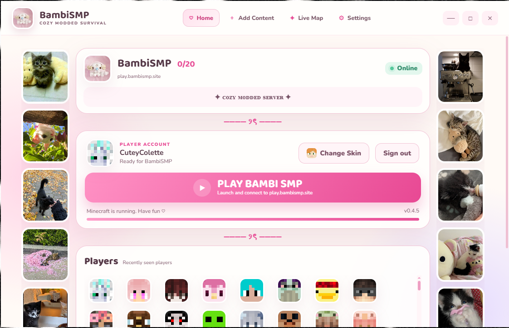
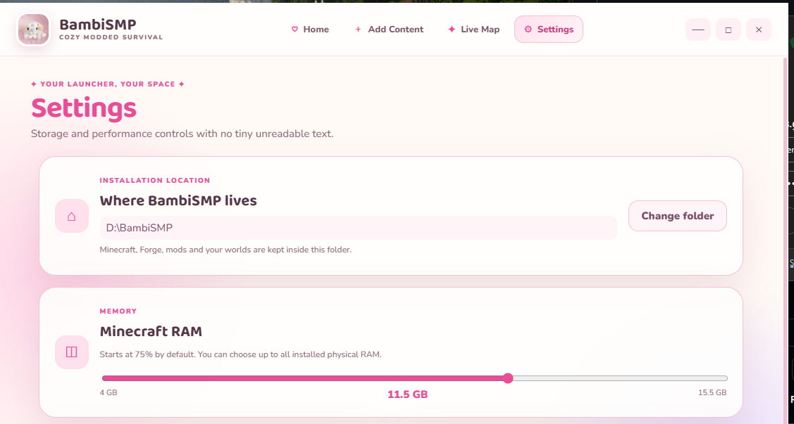
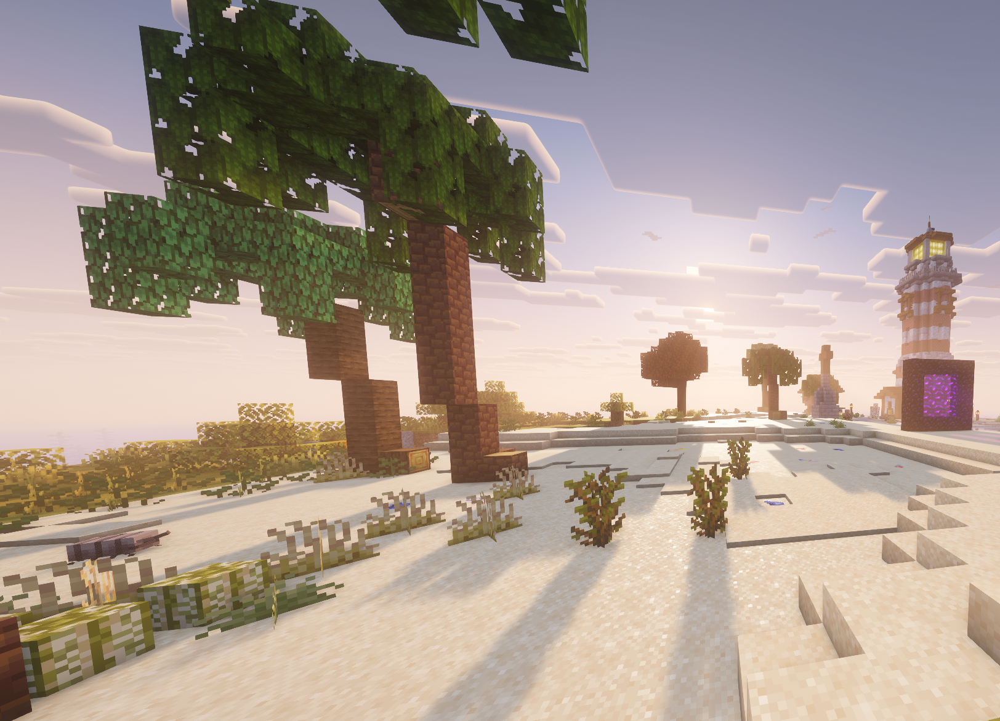

# Bambi SMP Launcher for Windows

The official desktop launcher for Bambi SMP — a cozy modded Minecraft survival server.





## What it does

- Signs in with a player's Microsoft account.
- Shows the live server status, player count, and MOTD before launch.
- Installs Minecraft, Forge, and the Bambi SMP modpack into a dedicated folder.
- Checks managed downloads before installation and repairs incomplete files.
- Launches Minecraft and joins `play.bambismp.site` automatically.
- Lets players browse and install compatible client mods, resource packs, and shaders through Modrinth.
- Keeps a simple library for enabling, disabling, or removing personal content.
- Includes the Bambi SMP live map and a configurable install location.



## Requirements

- Windows 10 or later
- A purchased Java Edition Minecraft account
- Internet access

## Run from source

Install Node.js 20+ and pnpm, then run:

```bash
pnpm install
pnpm start
```

## Build the Windows installer

```bash
pnpm install
pnpm dist
```

The NSIS installer is written to `dist/`.

## Configuration

Launcher and modpack settings live under `config/`. Do not commit personal tokens, passwords, or private URLs. `config/example-manifest.json` is the starting point for a new modpack manifest.

## Development note

This project was developed with assistance from OpenAI Codex. Bambi SMP owns the project direction, configuration, testing, and releases.

## License

Source-visible, all rights reserved unless Bambi SMP grants permission in writing.
